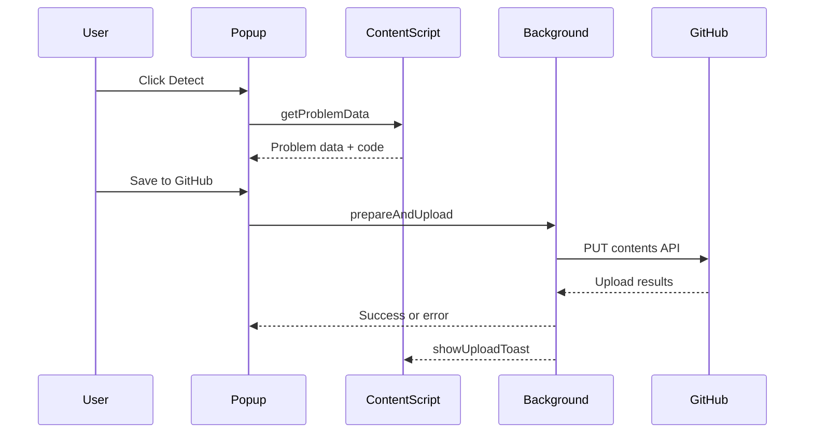

# Architecture

CodeBridge follows a simple extension architecture with three major layers: popup UI, content script adapters, and a background service worker.

## Components

- Popup UI: UI for auth, configuration, and uploads.
- Content script: Runs in problem pages, extracts metadata and code.
- Background service worker: Handles GitHub auth, upload logic, and notifications.
- Utilities: Template and file generation helpers.

## Subsystems

### 1. Session Tracker (Timer)
The Session Tracker (`src/content/sessionTracker.js` + `src/background/session/`) automatically tracks time spent on problems.
-   **Content Script**: Detects problems, injects a draggable timer overlay, and reports events (`start`, `pause`, `submit`).
-   **Background**: Persists session state (`chrome.storage.local`) across reloads and syncs multiple tabs.
-   **Adapters**: Platform-specific logic (`src/content/adapters/`) to handle different DOM structures.

## Data flow (sequence)

## Key modules

- Popup logic: src/popup.js
- Content script: src/content.js
- Session Tracker: src/content/sessionTracker.js
- Background entry: src/background/index.js
- Session Manager: src/background/session/sessionManager.js
- Device flow auth: src/background/auth/deviceFlow.js
- Upload pipeline: src/background/github/uploadService.js
- File generation: src/utils/fileStrategies.js
- Platform Adapters: src/content/adapters/
