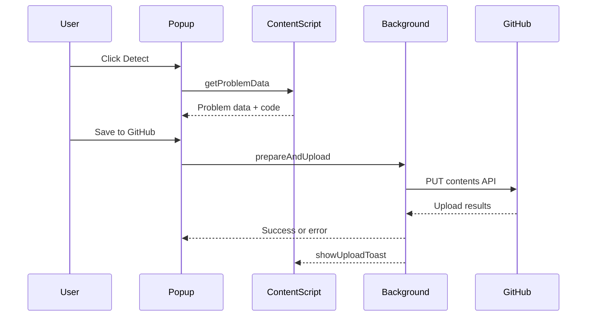

# Architecture

CodeBridge follows a simple extension architecture with three major layers: popup UI, content script adapters, and a background service worker.

## Components

- Popup UI: UI for auth, configuration, and uploads.
- Content script: Runs in problem pages, extracts metadata and code.
- Background service worker: Handles GitHub auth, upload logic, and notifications.
- Utilities: Template and file generation helpers.

## Data flow (sequence)

## Key modules

- Popup logic: src/popup.js
- Content script: src/content.js
- Background entry: src/background/index.js
- Device flow auth: src/background/auth/deviceFlow.js
- Upload pipeline: src/background/github/uploadService.js
- File generation: src/utils/fileStrategies.js
